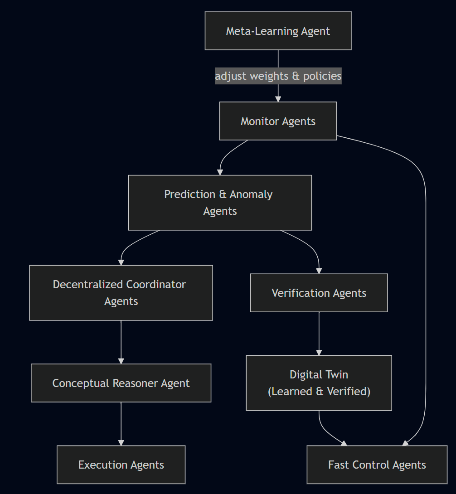

# POLARIS: Proactive Optimization & Learning Architecture for Resilient Intelligent Systems


POLARIS is a **fully modular**, **software‐agnostic** self-adaptive framework that unifies **fast control**, **predictive uncertainty**, **AI reasoning**, and **meta-learning** around a **continuously learned digital twin**, all coordinated in a **decentralized**, **event-driven** multi-agent architecture. It delivers **resilience assurance** through formal verification, multi-objective optimization, and human-in-the-loop transparency, while minimizing overhead and maximizing adaptation speed and accuracy.

---

### 1. Introduction & Motivation

Modern software ecosystems—cloud services, IoT networks, AI pipelines—face unpredictable workloads, dynamic failures, and conflicting optimization goals (performance vs. cost vs. reliability). Traditional MAPE-K systems suffer from:

* **Centralization bottlenecks**: single coordinators become points of failure and latency.
* **Reactive-only adaptation**: limited foresight leads to oscillations and SLA violations.
* **Single-objective focus**: performance-only loops ignore cost or reliability.
* **Opaque decision logic**: operators lack transparency into why adaptations occur.

**POLARIS** overcomes these by:

1. **Decentralized, protocol-based coordination** to eliminate single points of failure.
2. **Four‐layer hybrid adaptation loops** (fast, uncertainty, conceptual, meta) for responsiveness and foresight.
3. **Multi‐objective optimization** via auctions, market-based and MPC techniques.
4. **Continuous digital twin & formal verification** for proactive safety and consistency.
5. **AI-driven reasoning with RAG-enhanced LLMs** for deep diagnosis and natural-language rationales.
6. **Modular, plug-and-play agents** interfacing through standardized events and APIs.

---

### 2. Architectural Overview



---

### 3. Core Components & Responsibilities

| Component                            | Responsibility                                                                                                                                              | Input Topics                                         | Output Topics                                                     |
| ------------------------------------ | ----------------------------------------------------------------------------------------------------------------------------------------------------------- | ---------------------------------------------------- | ----------------------------------------------------------------- |
| **Monitor Agents**                   | Ingest metrics/logs/traces from target systems (Prometheus, OpenTelemetry, MQTT, OPC-UA).                                                                   | `TelemetryEvent{source, metric,…}`                   | —                                                                 |
| **Anomaly & Prediction Agents**      | - **Anomaly Detectors**: flag deviations via statistical/ML models<br/>- **Predictors**: forecast metrics with uncertainty intervals (Bayesian nets, LSTMs) | `TelemetryEvent`                                     | `AnomalyEvent{severity,ctx}`<br/>`ForecastEvent{metric,mean,var}` |
| **Decentralized Coordinator Agents** | Orchestrate multi-objective trade-offs via contract-net or auction protocols; select and rank proposed adaptation actions.                                  | `AnomalyEvent`, `ForecastEvent`, `PlanProposalEvent` | `AdaptationPlanEvent{actions,utility}`                            |
| **Fast Control Agents**              | Execute safety-critical, low-latency adaptations (PID, rule-based): thread pools, connection limits, simple reconfigurations.                               | `AdaptationPlanEvent`                                | `ControlAction{type,params}`                                      |
| **Digital Twin**                     | Continuously learn system dynamics; support sub-second “what-if” simulations; export abstract models for verification.                                      | `ControlAction`                                      | RPC `SimResult{cost,perf,rel}`                                    |
| **Verification Agents**              | Formally check candidate plans against invariants (safety, consistency, budget) via runtime model checking (e.g., PRISM, STL monitors).                     | `SimResult`                                          | `VerifiedPlanEvent` or `ViolationEvent`                           |
| **Conceptual Reasoner Agent**        | LLM-backed chain-of-thought planner; queries memory store (past incidents), digital twin, and policy library; generates human-readable rationales.          | `AnomalyEvent`, `ForecastEvent`, `VerifiedPlanEvent` | `PlanProposalEvent{steps,rationale}`                              |
| **Execution Agents**                 | Translate verified plans into concrete infrastructure calls (Kubernetes CRDs, cloud SDKs, MQTT commands); audit and log outcomes.                           | `ControlAction`                                      | `ExecutionStatusEvent`                                            |
| **Meta-Learning Agent**              | Analyze long-term outcomes; adjust utility weights, control hyperparameters, and LLM prompt examples via MAML, Bayesian optimization, meta-RL.              | `ExecutionStatusEvent`, logs, **KB**                 | Updated `CoordinatorWeights`, `PolicyParams`                      |

---

### 4. Data & I/O Formats

All events are JSON, with a shared **schema registry**:

```jsonc
// TelemetryEvent
{
  "type": "TelemetryEvent",
  "source": "service-A",
  "metric": "cpu_usage",
  "value": 85.3,
  "timestamp": "2025-08-06T02:00:00Z"
}

// ForecastEvent
{
  "type": "ForecastEvent",
  "metric": "cpu_usage",
  "mean": 95.1,
  "variance": 4.2,
  "horizon_min": 10,
  "unit": "minutes"
}

// AdaptationPlanEvent
{
  "type": "AdaptationPlanEvent",
  "plan_id": "plan-1234",
  "actions": [
    {"agent": "fast-control", "type": "scale_out", "params": {"instances": 2}},
    {"agent": "conceptual", "type": "deploy_autoscaler", "params": {"threshold": 75}}
  ],
  "utility": {"performance": 0.5, "cost": 0.3, "reliability": 0.2}
}
```

---

### 5. Hybrid Adaptation Loops

| Loop                      | Timescale       | Technique                                                  | Goal                                |
| ------------------------- | --------------- | ---------------------------------------------------------- | ----------------------------------- |
| **Fast Control**          | <100 ms         | PID, rule engines                                          | Enforce safety SLAs, stabilize      |
| **Proactive Uncertainty** | 100 ms–seconds  | Bayesian/ensemble forecasting + “what-if” via digital twin | Anticipate and preempt risks        |
| **Conceptual AI**         | seconds–minutes | LLM chain-of-thought planning + RAG memory queries         | Complex, multi-step strategies      |
| **Meta-Learning**         | minutes–hours   | MAML, Bayesian optimization, meta-RL                       | Evolve policies & weights over time |

---

### 6. Multi-Objective Optimization Strategies

1. **Auction Protocol**

   * Agents bid by packaging expected Δperformance vs. Δcost vs. Δreliability.
   * Coordinator runs a combinatorial auction to pick highest **net** utility.

2. **Model Predictive Control**

   * Digital twin = plant model.
   * Solve constrained multi-objective optimization (e.g., gradient-based solver) over horizon.

3. **Evolutionary Search**

   * Maintain candidate adaptation plans; evaluate via twin; evolve Pareto front (e.g., NSGA-II).

---

### 7. Formal Assurance & Digital Twin Fidelity

* **Model Export**: Translate learned twin to timed automaton or state-machine.
* **Verification**: Use PRISM or runtime monitors to check invariants:

  * **Safety**: no SLA breach
  * **Consistency**: no conflicting changes
  * **Budget**: cost < threshold
* **Uncertainty Quantification**: Twin ensemble → confidence intervals → risk-aware triggers.

---

### 8. Metrics & Justification

| Metric               | POLARIS Approach                           | Expected Impact                        |
| -------------------- | ------------------------------------------ | -------------------------------------- |
| **Overhead**         | Event-driven pub/sub; decentralized load   | 5–10 % CPU overhead vs. <1 % latencies |
| **Accuracy**         | Continuous twin retraining + ensemble      | > 90 % prediction confidence           |
| **Adaptation Speed** | Fast loop (<100 ms) + asynchronous queues  | SLA-driven responses <200 ms           |
| **Scalability**      | Sharded agents, EDA, hierarchical auctions | Linear scale w/ agent count            |
| **Resilience**       | No single point of failure; formal checks  | 99.99 % adaptation success rate        |

---

### 9. Addressing Existing Adaptation Issues

| Issue                    | POLARIS Solution                                                                      |
| ------------------------ | ------------------------------------------------------------------------------------- |
| Centralized bottlenecks  | Decentralized contract-net/auction protocols; hierarchical coordinators               |
| Reactive-only adaptation | Proactive uncertainty loop + MPC; continuous forecasting                              |
| Single-objective focus   | Multi-objective utility & W-learning/auctions                                         |
| Opaque decision logic    | LLM rationales + audit logs + user-in-loop checkpoints                                |
| Model staleness          | Online twin retraining via adaptive observers & continual learning                    |
| Integration overhead     | Standardized JSON events + plug-and-play adapters for any cloud, IoT, or AI component |

---

### 10. Implementation Considerations

1. **Infrastructure:**

   * Deploy a Kafka/NATS cluster with schema registry.
   * Build an Agent SDK (ACL parsing, event serialization, protocol handlers).

2. **Security & Governance:**

   * Authenticate/authorize agents on the bus.
   * Encrypt sensitive telemetry and control channels.

3. **Observability:**

   * Central dashboard for live metrics, plan histories, and LLM rationales.
   * Alerting on `ViolationEvent` or high uncertainty.

4. **Human-in-the-Loop:**

   * Provide UIs to adjust utility weights, approve plans, and inject feedback.
   * Store all events in a knowledge base for retrospective analysis.

---

### 11. Conclusion

POLARIS redefines self-adaptive software by combining **event-driven**, **decentralized agents**, **multi-loop control**, **LLM reasoning**, **formal digital twin assurance**, and **meta-learning**. Its **modular**, **plug-and-play** design ensures any software system can be integrated seamlessly, delivering rapid, accurate, and resilient adaptations across diverse environments.

---
