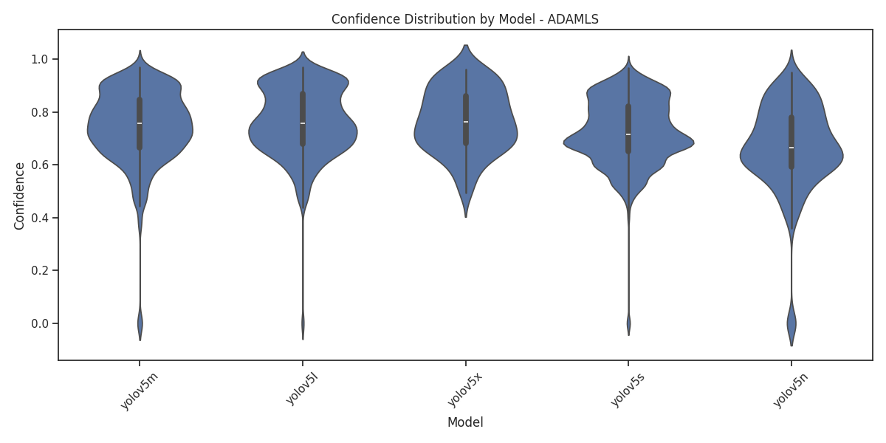
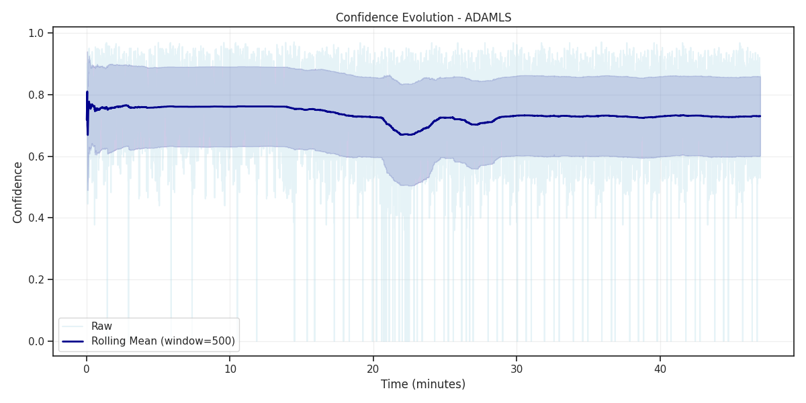
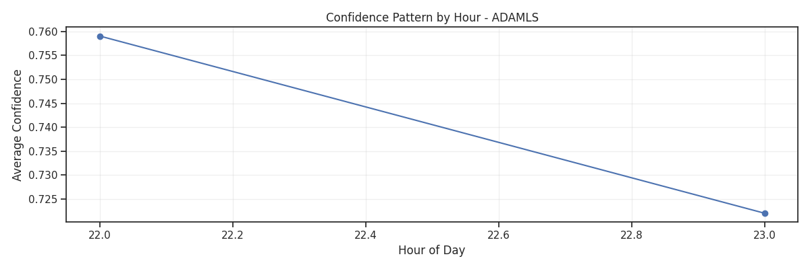
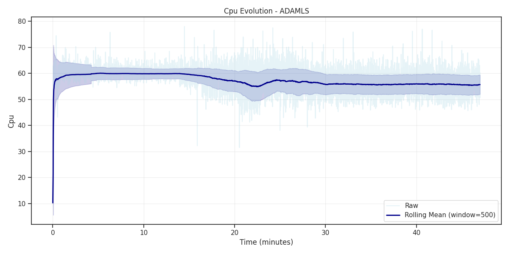
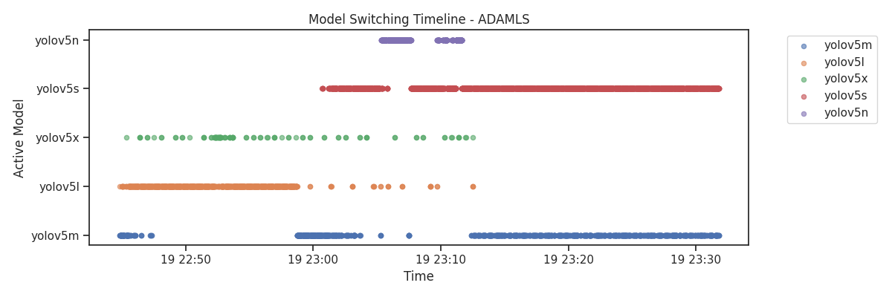
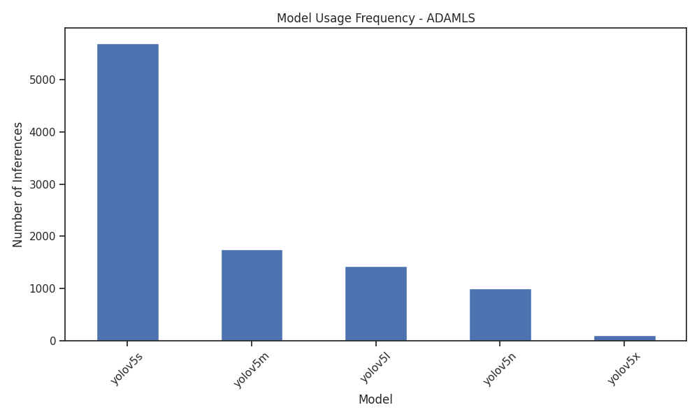
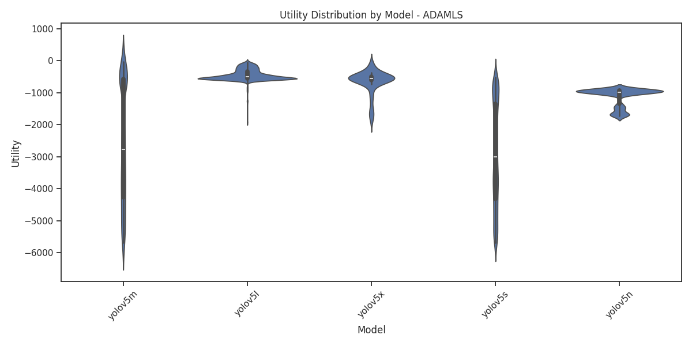

# Detailed Analysis Report: ADAMLS

## Basic Statistics

- **Total Inferences**: 10,000
- **Duration**: 47.00 minutes
- **Inference Rate**: 212.78 inferences/minute
- **Unique Models Used**: 5
- **Most Used Model**: yolov5s

## Performance Metrics

| Metric | Mean | Std | Min | Max | Median |
|--------|------|-----|-----|-----|--------|
| Confidence | 0.7287 | 0.1362 | 0.0000 | 0.9707 | 0.7254 |
| Utility | -2324.1113 | 1735.3228 | -5693.0568 | -36.2563 | -1805.3934 |
| Model Processing Time | 0.2471 | 0.3088 | 0.0347 | 4.1259 | 0.1322 |
| Cpu | 56.8485 | 4.2070 | 10.3000 | 78.0000 | 57.2000 |
| Detection Boxes | 5.0396 | 4.4050 | 0.0000 | 33.0000 | 4.0000 |

## Model-Specific Analysis

### Model Usage Frequency

- **yolov5s**: 5,695 inferences (57.0%)
- **yolov5m**: 1,754 inferences (17.5%)
- **yolov5l**: 1,436 inferences (14.4%)
- **yolov5n**: 1,010 inferences (10.1%)
- **yolov5x**: 105 inferences (1.1%)

### Best Model by Confidence
**yolov5x**: 0.7687

### Best Model by Utility
**yolov5l**: -450.9948

## Key Insights

- Analysis complete. See visualizations for detailed patterns.

## Generated Visualizations

The following plots have been generated for this approach:

- 
- 
- 
- 
- 
- 
- 
- 
- 
- 
- 
- 
- 
- 
- 

