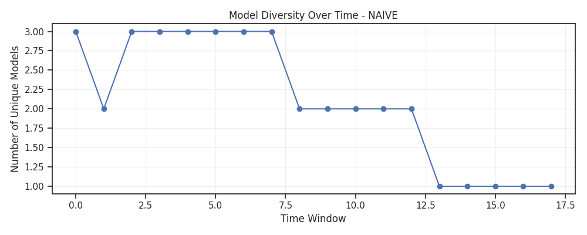
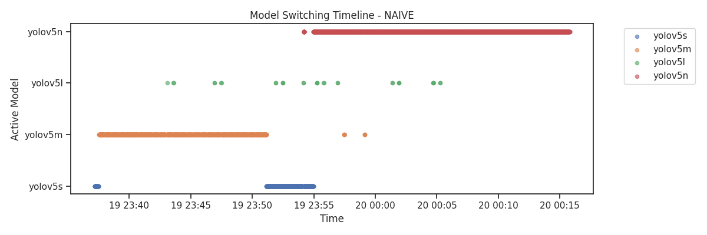
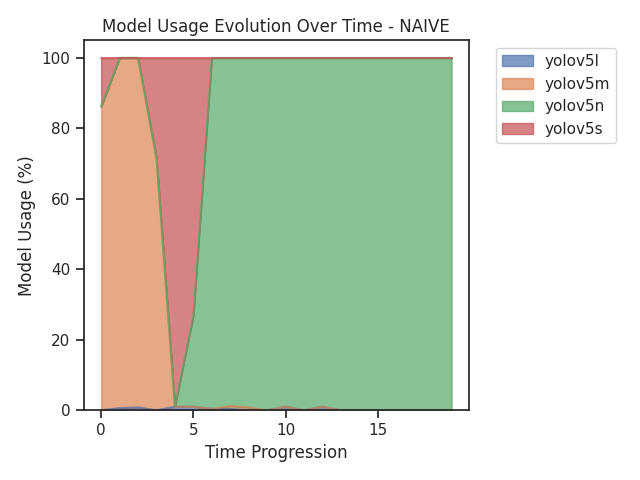
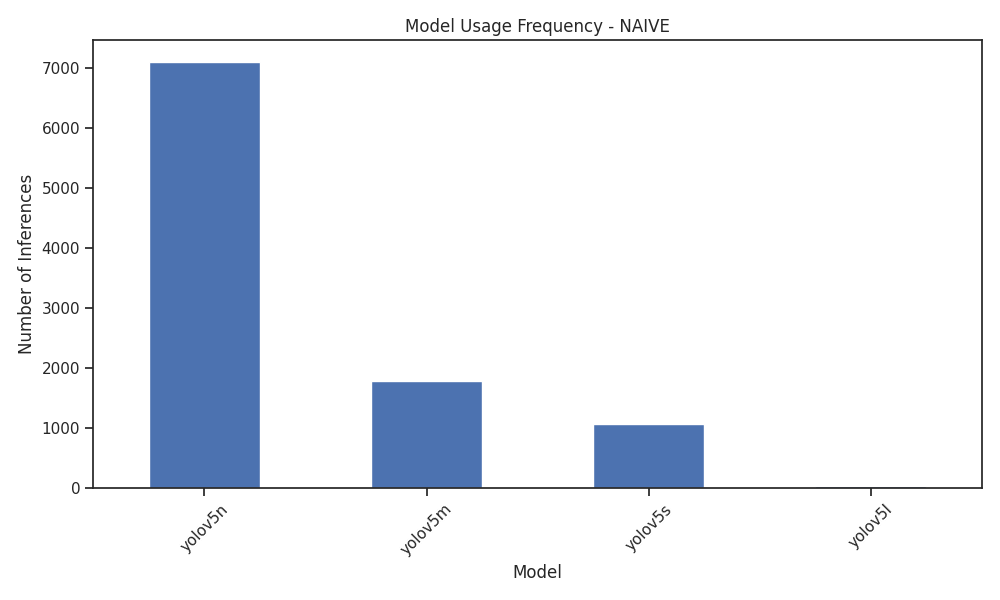
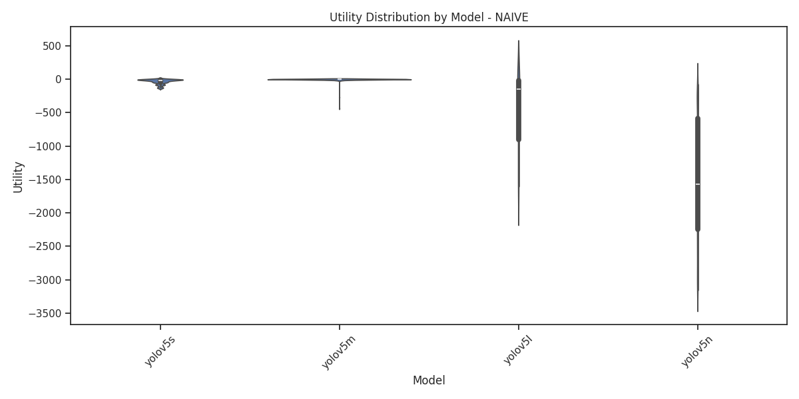
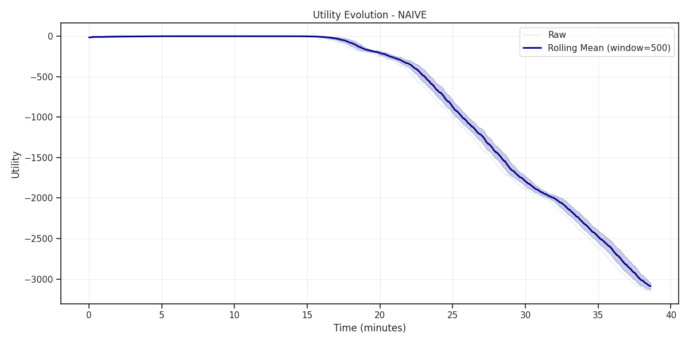

# Detailed Analysis Report: NAIVE

## Basic Statistics

- **Total Inferences**: 10,000
- **Duration**: 38.60 minutes
- **Inference Rate**: 259.04 inferences/minute
- **Unique Models Used**: 4
- **Most Used Model**: yolov5n

## Performance Metrics

| Metric | Mean | Std | Min | Max | Median |
|--------|------|-----|-----|-----|--------|
| Confidence | 0.6901 | 0.1591 | 0.0000 | 0.9707 | 0.6926 |
| Utility | -1080.3311 | 1045.7288 | -3151.9954 | 0.8645 | -782.0801 |
| Model Processing Time | 0.1882 | 0.2854 | 0.0288 | 4.0508 | 0.0798 |
| Cpu | 54.3882 | 5.6976 | 7.7000 | 80.1000 | 54.7000 |
| Detection Boxes | 4.2744 | 3.7169 | 0.0000 | 33.0000 | 3.0000 |

## Model-Specific Analysis

### Model Usage Frequency

- **yolov5n**: 7,107 inferences (71.1%)
- **yolov5m**: 1,790 inferences (17.9%)
- **yolov5s**: 1,072 inferences (10.7%)
- **yolov5l**: 31 inferences (0.3%)

### Best Model by Confidence
**yolov5l**: 0.7638

### Best Model by Utility
**yolov5m**: -2.7779

## Key Insights

- **Low Adaptivity**: Minimal model switching, suggesting stable conditions or conservative strategy

## Generated Visualizations

The following plots have been generated for this approach:

- 
- 
- 
- 
- 
- 
- 
- 
- 
- 
- 
- 
- 
- 
- 

