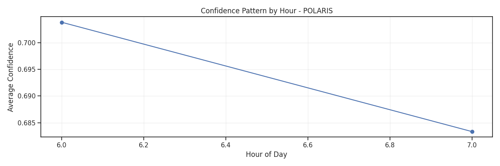
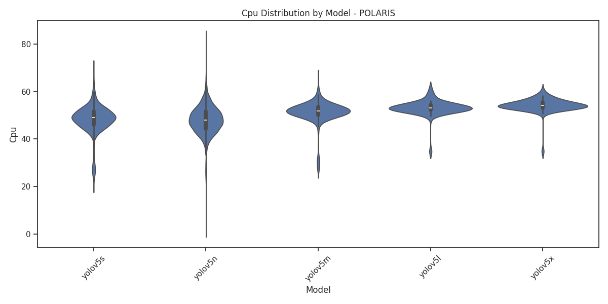
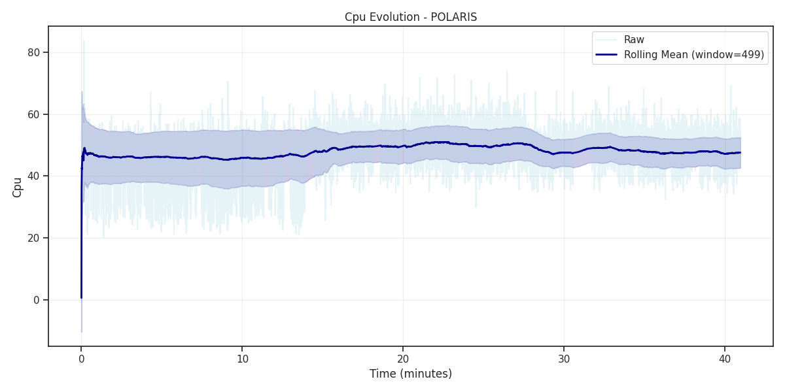
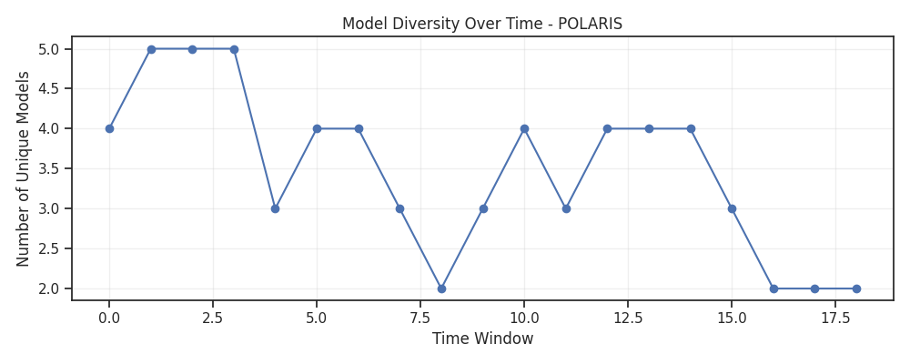
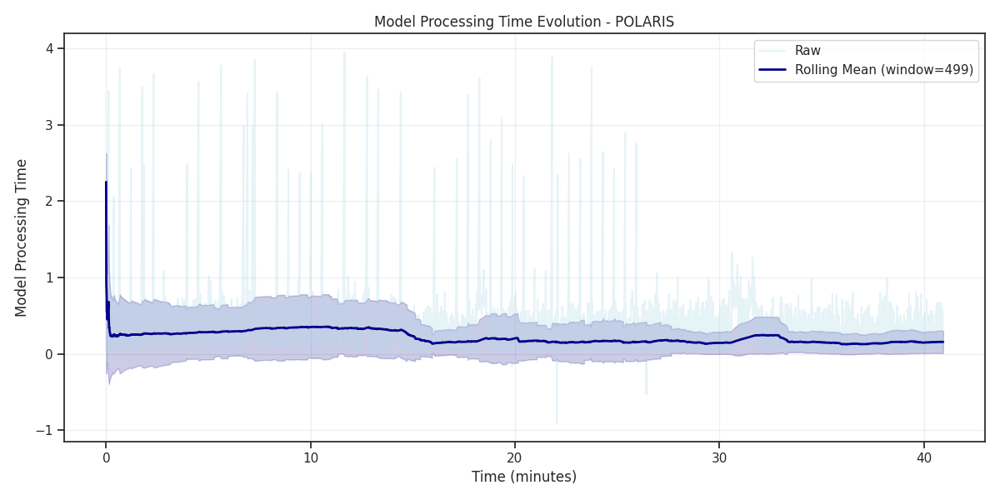
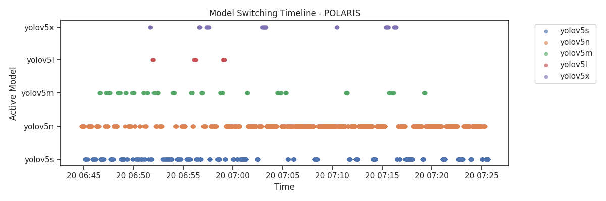
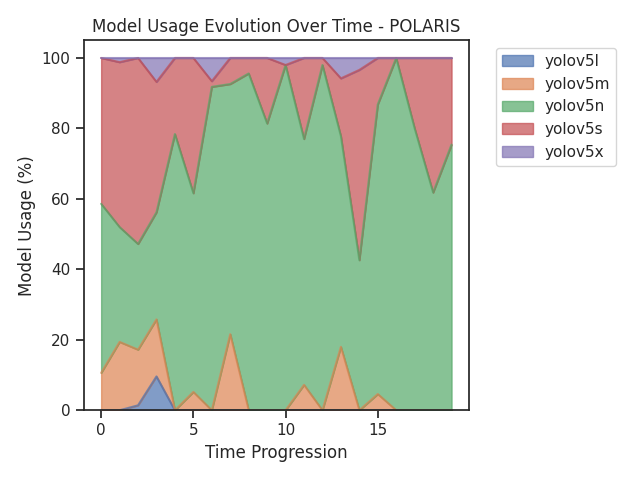
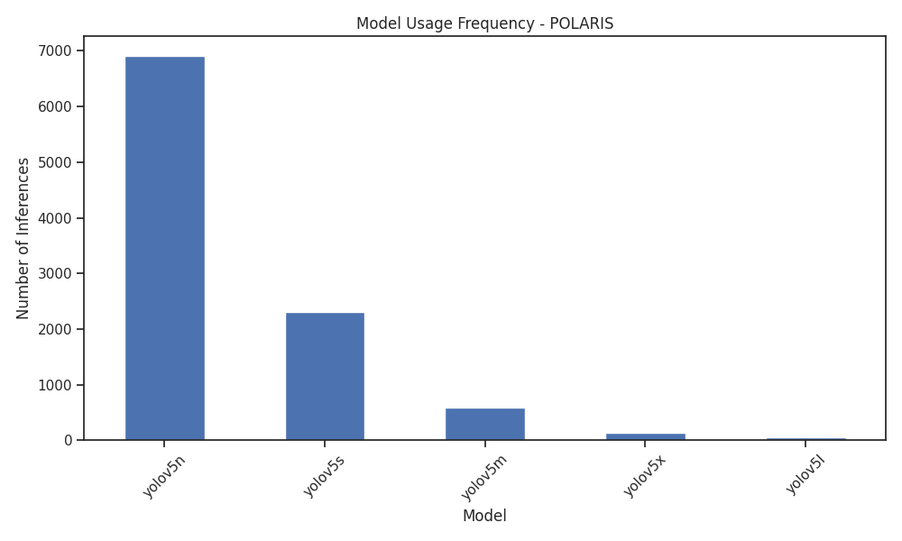
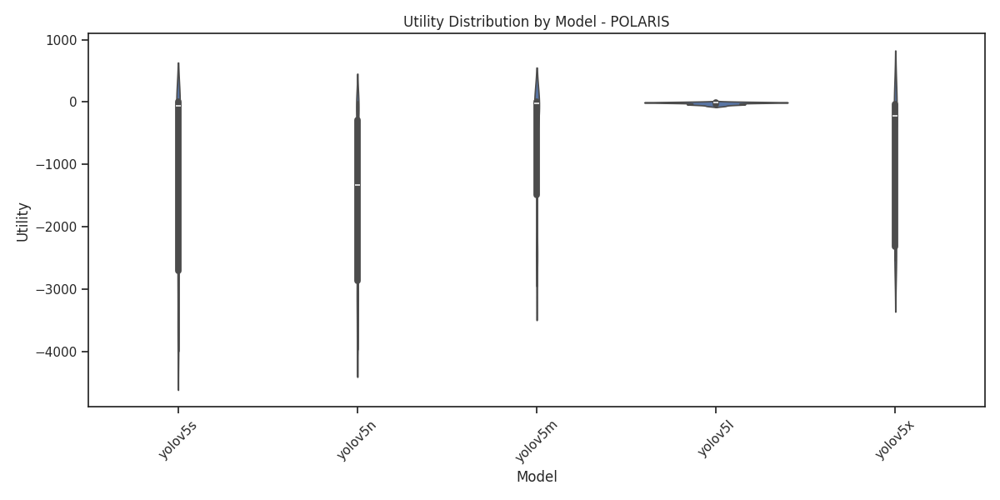
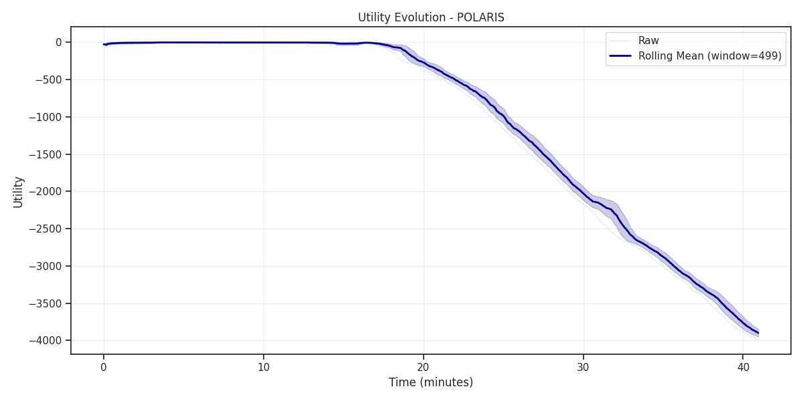

# Detailed Analysis Report: POLARIS

## Basic Statistics

- **Total Inferences**: 9,999
- **Duration**: 40.95 minutes
- **Inference Rate**: 244.19 inferences/minute
- **Unique Models Used**: 5
- **Most Used Model**: yolov5n

## Performance Metrics

| Metric | Mean | Std | Min | Max | Median |
|--------|------|-----|-----|-----|--------|
| Confidence | 0.6879 | 0.1578 | 0.0000 | 0.9707 | 0.6880 |
| Utility | -1433.4153 | 1366.0196 | -3986.4834 | 0.9067 | -1070.5110 |
| Model Processing Time | 0.1898 | 0.2552 | -0.9102 | 3.9520 | 0.0965 |
| Cpu | 48.3561 | 6.0304 | 0.7000 | 83.6000 | 48.8000 |
| Detection Boxes | 4.2488 | 3.6119 | 0.0000 | 31.0000 | 3.0000 |

## Model-Specific Analysis

### Model Usage Frequency

- **yolov5n**: 6,915 inferences (69.2%)
- **yolov5s**: 2,307 inferences (23.1%)
- **yolov5m**: 593 inferences (5.9%)
- **yolov5x**: 129 inferences (1.3%)
- **yolov5l**: 55 inferences (0.6%)

### Best Model by Confidence
**yolov5l**: 0.7829

### Best Model by Utility
**yolov5l**: -21.3223

## Key Insights

- Analysis complete. See visualizations for detailed patterns.

## Generated Visualizations

The following plots have been generated for this approach:

- 
- 
- 
- 
- 
- 
- 
- 
- 
- 
- 
- 
- 
- 
- 

