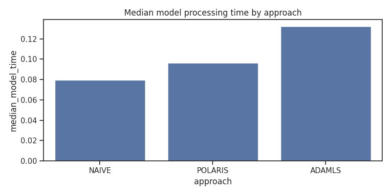
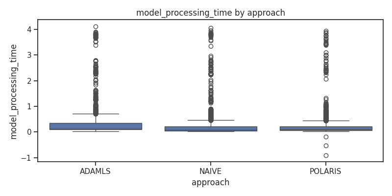
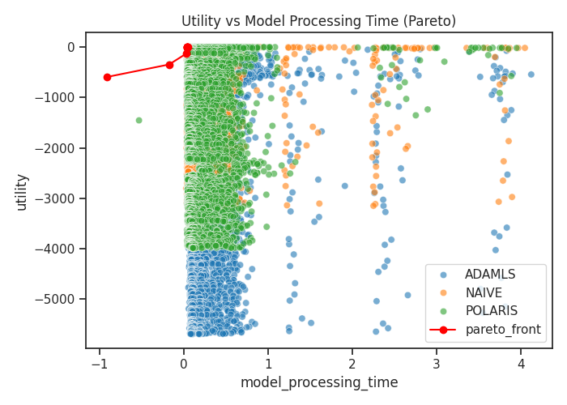

# Cross-approach comparison report

Generated by analysis.py — contains comparisons between approaches (ADAMLS, NAIVE, POLARIS).

## Summary table

approach,count,mean_confidence,median_model_time,mean_cpu
ADAMLS,10000,0.7287417777316636,0.1321989297866821,56.848530000000004
NAIVE,10000,0.6900832911915245,0.07982873916625975,54.38823999999999
POLARIS,9999,0.6879398496630272,0.096494436264038,48.356055605560556

## Comparative plots

## Short analysis

- The bar plots show the average behavior (confidence, utility) per approach.
- Boxplots reveal distributions and variance — look for overlap and outliers.
- Pareto front highlights trade-offs between model processing time and utility: points on the red line are non-dominated.

