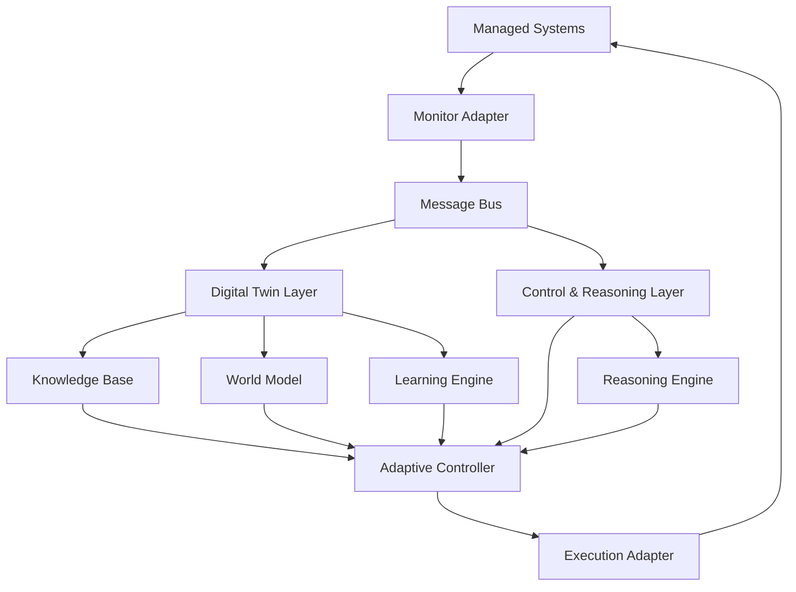

# Data Flow & Integration

## Overview

POLARIS implements a sophisticated data flow architecture that enables seamless integration between components while maintaining loose coupling and high performance. This document details how data flows through the system, integration patterns, and communication mechanisms.

## Data Flow Architecture

### Event-Driven Data Flow



### Primary Data Flows

#### 1. Telemetry Collection Flow
```
Managed System → Monitor Adapter → TelemetryEvent → Message Bus → Digital Twin Components
```

**Data Transformation**:
- Raw metrics → Structured MetricValue objects
- System-specific formats → Standardized TelemetryEvent
- Real-time streams → Batched processing (configurable)

**Processing Steps**:
1. **Collection**: Monitor adapter collects raw metrics
2. **Normalization**: Convert to standard format
3. **Validation**: Ensure data quality and completeness
4. **Publishing**: Send TelemetryEvent to message bus
5. **Distribution**: Route to interested subscribers

#### 2. Adaptation Decision Flow
```
TelemetryEvent → Adaptive Controller → Reasoning Engine → Control Strategy → AdaptationAction
```

**Decision Process**:
1. **Analysis**: Assess current system state
2. **Need Detection**: Identify adaptation requirements
3. **Strategy Selection**: Choose appropriate control strategy
4. **Action Planning**: Generate specific adaptation actions
5. **Validation**: Verify action feasibility and safety

#### 3. Action Execution Flow
```
AdaptationAction → Execution Adapter → Managed System → ExecutionResult → Knowledge Base
```

**Execution Pipeline**:
1. **Pre-validation**: Check action parameters and preconditions
2. **Execution**: Perform the adaptation action
3. **Post-verification**: Confirm successful execution
4. **Result Capture**: Record execution outcomes
5. **Learning**: Update knowledge base with results

#### 4. Learning and Knowledge Flow
```
ExecutionResult → Learning Engine → LearnedPattern → Knowledge Base → Future Decisions
```

**Learning Process**:
1. **Pattern Recognition**: Identify recurring patterns
2. **Knowledge Extraction**: Extract actionable insights
3. **Storage**: Persist learned knowledge
4. **Application**: Use knowledge in future decisions

## Integration Patterns

### 1. Event-Driven Integration

**Pattern**: Components communicate through asynchronous events

**Implementation**:
```python
# Event publishing
await event_bus.publish_telemetry(telemetry_event)

# Event subscription
async def handle_telemetry(event: TelemetryEvent):
    await world_model.update_system_state(event)

event_bus.subscribe(TelemetryEvent, handle_telemetry)
```

**Benefits**:
- Loose coupling between components
- Scalable message processing
- Fault isolation
- Temporal decoupling

### 2. Repository Integration

**Pattern**: Data access through repository abstractions

**Implementation**:
```python
class SystemStateRepository:
    async def save_current_state(self, state: SystemState) -> None
    async def get_current_state(self, system_id: str) -> Optional[SystemState]
    async def get_state_history(self, system_id: str, 
                               time_range: TimeRange) -> List[SystemState]
```

**Benefits**:
- Data access abstraction
- Pluggable storage backends
- Consistent data operations
- Transaction support

### 3. Plugin Integration

**Pattern**: External systems integrate through standardized plugin interface

**Implementation**:
```python
class ManagedSystemConnector(ABC):
    @abstractmethod
    async def collect_metrics(self) -> Dict[str, MetricValue]
    
    @abstractmethod
    async def execute_action(self, action: AdaptationAction) -> ExecutionResult
```

**Benefits**:
- Standardized integration interface
- Hot-pluggable connectors
- System-agnostic design
- Configuration-driven setup

### 4. Strategy Integration

**Pattern**: Pluggable algorithms through strategy pattern

**Implementation**:
```python
class ControlStrategy(ABC):
    @abstractmethod
    async def generate_actions(self, system_id: str, 
                             current_state: Dict[str, Any],
                             adaptation_need: AdaptationNeed) -> List[AdaptationAction]

# Runtime strategy selection
strategy = strategy_selector.select_strategy(context)
actions = await strategy.generate_actions(system_id, state, need)
```

## Message Bus Integration

### NATS Message Broker

**Configuration**:
```yaml
message_bus:
  nats:
    servers:
      - "nats://localhost:4222"
      - "nats://backup:4222"
    name: "polaris-client"
    max_reconnect_attempts: 10
    reconnect_time_wait: 2
```

**Topic Structure**:
```
polaris.telemetry.{system_id}     # System telemetry events
polaris.adaptations.{system_id}   # Adaptation events
polaris.executions.{system_id}    # Execution results
polaris.health.{component}        # Component health events
polaris.config.updates            # Configuration changes
```

### Message Middleware

**Logging Middleware**:
```python
class LoggingMiddleware(MessageMiddleware):
    async def process(self, context: MessageContext, next_handler: Callable) -> Any:
        logger.info(f"Processing message: {context.topic}")
        start_time = time.time()
        try:
            result = await next_handler(context)
            duration = time.time() - start_time
            logger.info(f"Message processed successfully in {duration:.3f}s")
            return result
        except Exception as e:
            logger.error(f"Message processing failed: {e}")
            raise
```

**Metrics Middleware**:
```python
class MetricsMiddleware(MessageMiddleware):
    async def process(self, context: MessageContext, next_handler: Callable) -> Any:
        with message_processing_time.labels(topic=context.topic).time():
            message_count.labels(topic=context.topic).inc()
            try:
                result = await next_handler(context)
                message_success_count.labels(topic=context.topic).inc()
                return result
            except Exception:
                message_error_count.labels(topic=context.topic).inc()
                raise
```

## Data Storage Integration

### Multi-Backend Storage

**Backend Selection**:
```python
class PolarisDataStore:
    def __init__(self, backends: Dict[str, StorageBackend]):
        self._backends = backends
    
    def _time_series(self) -> TimeSeriesStorageBackend:
        return self._backends["time_series"]
    
    def _documents(self) -> DocumentStorageBackend:
        return self._backends["documents"]
    
    def _graph(self) -> GraphStorageBackend:
        return self._backends["graph"]
```

**Repository Pattern**:
```python
class SystemStateRepository:
    def __init__(self, data_store: PolarisDataStore):
        self._data_store = data_store
    
    async def save_current_state(self, state: SystemState) -> None:
        # Store in time-series backend
        await self._data_store._time_series().store_time_series(
            collection="system_states",
            timestamp=state.timestamp,
            tags={"system_id": state.system_id},
            fields=state.to_dict()
        )
```

### CQRS Implementation

**Command Side (Writes)**:
```python
class KnowledgeBaseCommands:
    async def store_telemetry(self, telemetry: TelemetryEvent) -> None:
        await self._states().save(telemetry.system_state)
        await self._publish_event(TelemetryStoredEvent(telemetry))
    
    async def store_adaptation_result(self, result: ExecutionResult) -> None:
        await self._adaptations().save(result)
        await self._publish_event(AdaptationCompletedEvent(result))
```

**Query Side (Reads)**:
```python
class KnowledgeBaseQueries:
    async def get_current_state(self, system_id: str) -> Optional[SystemState]:
        return await self._states().get_current_state(system_id)
    
    async def query_patterns(self, pattern_type: str, 
                           conditions: Dict[str, Any]) -> List[LearnedPattern]:
        return await self._patterns().find_matching(pattern_type, conditions)
```

## Component Communication

### Synchronous Communication

**Direct Method Calls**:
```python
# Within same layer or for immediate operations
result = await world_model.predict_system_behavior(system_id, time_horizon)
```

**gRPC Services** (Future Enhancement):
```python
# For cross-service communication in distributed deployment
async def simulate_action(self, request: SimulateActionRequest) -> SimulateActionResponse:
    result = await self._world_model.simulate_adaptation_impact(
        request.system_id, request.action
    )
    return SimulateActionResponse(result=result)
```

### Asynchronous Communication

**Event Publishing**:
```python
# Fire-and-forget event publishing
await event_bus.publish_adaptation_event(AdaptationEvent(
    system_id=system_id,
    reason="High CPU usage detected",
    suggested_actions=actions,
    severity="warning"
))
```

**Request-Response Pattern**:
```python
# Asynchronous request-response through message bus
response = await message_bus.request(
    topic="polaris.reasoning.analyze",
    request=AnalysisRequest(system_id=system_id, context=context),
    timeout=30.0
)
```

## Error Handling and Resilience

### Circuit Breaker Integration

```python
class AdapterWithCircuitBreaker:
    def __init__(self, connector: ManagedSystemConnector, 
                 circuit_breaker: CircuitBreaker):
        self._connector = connector
        self._circuit_breaker = circuit_breaker
    
    async def collect_metrics(self) -> Dict[str, MetricValue]:
        return await self._circuit_breaker.call(
            self._connector.collect_metrics
        )
```

### Retry Policy Integration

```python
class ResilientMessageBus:
    async def publish_with_retry(self, topic: str, event: Any) -> None:
        await self._retry_policy.execute(
            lambda: self._message_bus.publish(topic, event),
            operation_name=f"publish_to_{topic}"
        )
```

### Bulkhead Integration

```python
class BulkheadProtectedService:
    async def process_telemetry(self, event: TelemetryEvent) -> None:
        await self._telemetry_bulkhead.execute(
            lambda: self._process_telemetry_internal(event),
            operation_name="process_telemetry"
        )
```

## Performance Optimization

### Batching and Aggregation

**Telemetry Batching**:
```python
class BatchingTelemetryProcessor:
    def __init__(self, batch_size: int = 100, flush_interval: float = 5.0):
        self._batch_size = batch_size
        self._flush_interval = flush_interval
        self._batch = []
    
    async def process_telemetry(self, event: TelemetryEvent) -> None:
        self._batch.append(event)
        if len(self._batch) >= self._batch_size:
            await self._flush_batch()
```

**Metric Aggregation**:
```python
class MetricAggregator:
    async def aggregate_metrics(self, system_id: str, 
                              time_window: timedelta) -> Dict[str, Any]:
        # Aggregate metrics over time window
        raw_metrics = await self._get_raw_metrics(system_id, time_window)
        return {
            "avg_cpu": sum(m.cpu for m in raw_metrics) / len(raw_metrics),
            "max_memory": max(m.memory for m in raw_metrics),
            "total_requests": sum(m.requests for m in raw_metrics)
        }
```

### Caching Strategies

**State Caching**:
```python
class CachedWorldModel:
    def __init__(self, world_model: PolarisWorldModel, cache_ttl: int = 300):
        self._world_model = world_model
        self._cache = TTLCache(maxsize=1000, ttl=cache_ttl)
    
    async def get_system_state(self, system_id: str) -> SystemState:
        cache_key = f"state:{system_id}"
        if cache_key in self._cache:
            return self._cache[cache_key]
        
        state = await self._world_model.get_system_state(system_id)
        self._cache[cache_key] = state
        return state
```

### Connection Pooling

**Database Connection Pool**:
```python
class PooledStorageBackend:
    def __init__(self, connection_string: str, pool_size: int = 10):
        self._pool = asyncio.create_pool(
            connection_string, 
            min_size=1, 
            max_size=pool_size
        )
    
    async def execute_query(self, query: str, params: Dict[str, Any]) -> List[Dict]:
        async with self._pool.acquire() as connection:
            return await connection.fetch(query, **params)
```

## Monitoring and Observability

### Distributed Tracing

```python
class TracedComponent:
    async def process_request(self, request: Any) -> Any:
        with tracer.start_span("process_request") as span:
            span.set_attribute("component", self.__class__.__name__)
            span.set_attribute("request_id", request.id)
            
            try:
                result = await self._process_internal(request)
                span.set_attribute("success", True)
                return result
            except Exception as e:
                span.set_attribute("success", False)
                span.set_attribute("error", str(e))
                raise
```

### Metrics Collection

```python
class MetricsCollector:
    def __init__(self):
        self.message_count = Counter('polaris_messages_total', 
                                   ['topic', 'status'])
        self.processing_time = Histogram('polaris_processing_seconds',
                                       ['component', 'operation'])
    
    def record_message_processed(self, topic: str, success: bool):
        status = "success" if success else "error"
        self.message_count.labels(topic=topic, status=status).inc()
```

## Configuration-Driven Integration

### Dynamic Configuration

```python
class ConfigurableIntegration:
    def __init__(self, config: PolarisConfiguration):
        self._config = config
        self._config.add_change_listener(self._on_config_change)
    
    async def _on_config_change(self, changes: Dict[str, Any]) -> None:
        if "message_bus" in changes:
            await self._reconfigure_message_bus(changes["message_bus"])
        if "storage" in changes:
            await self._reconfigure_storage(changes["storage"])
```

### Environment-Specific Configuration

```yaml
# Development environment
message_bus:
  nats:
    servers: ["nats://localhost:4222"]
    
# Production environment  
message_bus:
  nats:
    servers: 
      - "nats://prod-nats-1:4222"
      - "nats://prod-nats-2:4222"
      - "nats://prod-nats-3:4222"
    tls:
      enabled: true
      cert_file: "/etc/certs/client.crt"
      key_file: "/etc/certs/client.key"
```

## Integration Testing

### End-to-End Flow Testing

```python
class TestDataFlowIntegration:
    async def test_telemetry_to_adaptation_flow(self):
        # Arrange
        system_id = "test-system"
        telemetry_event = create_test_telemetry_event(system_id)
        
        # Act
        await message_bus.publish_telemetry(telemetry_event)
        
        # Wait for processing
        await asyncio.sleep(1.0)
        
        # Assert
        adaptations = await get_adaptations_for_system(system_id)
        assert len(adaptations) > 0
        assert adaptations[0].system_id == system_id
```

### Component Integration Testing

```python
class TestComponentIntegration:
    async def test_world_model_knowledge_base_integration(self):
        # Test that world model updates are reflected in knowledge base
        state = create_test_system_state()
        
        await world_model.update_system_state(state)
        
        stored_state = await knowledge_base.get_current_state(state.system_id)
        assert stored_state == state
```

---

*Continue to [Infrastructure Layer](./07-infrastructure-layer.md) →*